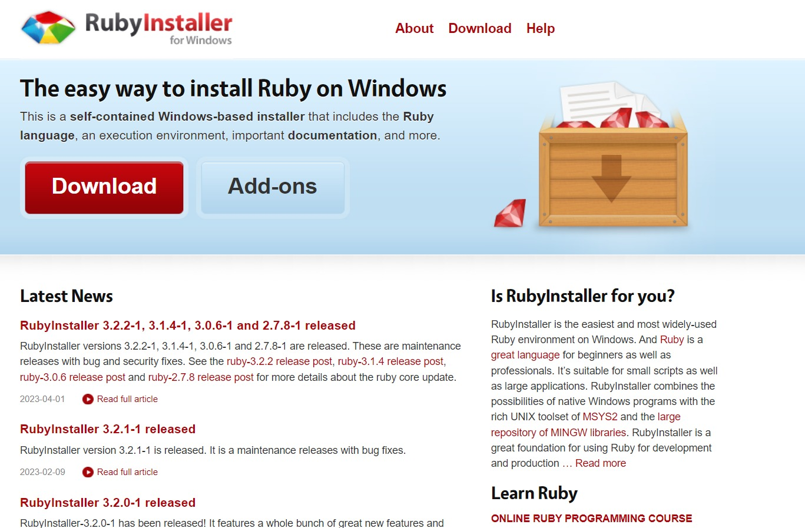

# RUBY

    

# Introdução à Linguagem Ruby

Este projeto tem como objetivo fornecer uma introdução abrangente à linguagem de programação Ruby. Aqui você encontrará informações sobre os conceitos básicos da linguagem, sua sintaxe, recursos avançados e exemplos práticos.

## O que é Ruby?

Ruby é uma linguagem de programação dinâmica, orientada a objetos e de propósito geral. Foi criada em 1995 por Yukihiro "Matz" Matsumoto no Japão e é conhecida por sua sintaxe limpa e elegante, que prioriza a legibilidade e a produtividade do desenvolvedor.

## Objetivo do Projeto

Este projeto tem como objetivo fornecer uma introdução passo a passo para a linguagem Ruby, abordando os seguintes tópicos:

- Instalação e configuração do ambiente de desenvolvimento Ruby.
- Conceitos básicos da linguagem, como variáveis, tipos de dados, estruturas de controle e funções.
- Trabalhando com objetos e classes em Ruby.
- Explorando a biblioteca padrão do Ruby e o gerenciamento de pacotes com o RubyGems.
- Utilização de bibliotecas populares do Ruby.
- Introdução ao desenvolvimento web com Ruby.
- Explorando frameworks populares, como Ruby on Rails.
- Boas práticas de programação Ruby.
- Exemplos de código e exercícios práticos para fortalecer o aprendizado.

## Como usar este projeto

Você pode navegar pelos arquivos deste repositório para encontrar o conteúdo relacionado à introdução à linguagem Ruby. Cada tópico é organizado em um arquivo separado, contendo explicações teóricas e exemplos práticos.

Sinta-se à vontade para explorar, clonar ou fazer o download deste repositório e utilizá-lo como um guia de referência enquanto aprende Ruby.

## Contribuição

Se você encontrar algum problema, erro de digitação ou tiver sugestões de melhoria, fique à vontade para abrir uma "issue" neste repositório. Será um prazer receber contribuições para tornar este guia mais completo e útil para a comunidade Ruby.

## Recursos Adicionais

Aqui estão alguns recursos adicionais que podem ser úteis para você aprender mais sobre a linguagem Ruby:

- [Documentação oficial do Ruby](https://www.ruby-lang.org/pt/documentation/)
- [RubyGems](https://rubygems.org/) - Repositório de pacotes Ruby.
- [Ruby on Rails](https://rubyonrails.org/) - Framework web popular para Ruby.
- [Ruby Weekly](https://rubyweekly.com/) - Newsletter semanal com notícias e atualizações sobre o mundo Ruby.

## Instalação da Linguagem Ruby

Este guia fornece instruções passo a passo para a instalação da linguagem Ruby em seu sistema.

### Passo 1: Verificar pré-requisitos

Antes de prosseguir com a instalação do Ruby, verifique se seu sistema atende aos seguintes pré-requisitos:

Conexão de internet estável.
Espaço suficiente em disco para a instalação.

### Passo 2: Escolher o método de instalação

Existem diferentes métodos de instalação do Ruby, dependendo do sistema operacional. Escolha o método adequado para o seu sistema:

- Instalação no Windows
- Instalação no macOS
- Instalação no Linux
Escolha o método apropriado para prosseguir.

### Instalação no Windows

#### Passo 3: Baixar o instalador

Acesse o site oficial do Ruby em https://www.ruby-lang.org/pt/downloads/
Clique no link para baixar o instalador para Windows.
Siga as instruções de download para obter o arquivo de instalação.

#### Passo 4: Executar o instalador

Localize o arquivo de instalação que você baixou.
Execute o arquivo e siga as instruções do instalador para concluir a instalação do Ruby.

### Instalação no macOS

#### Passo 3: Usar o gerenciador de pacotes Homebrew (recomendado)

Abra o Terminal.
Instale o Homebrew, caso ainda não o tenha, seguindo as instruções em https://brew.sh/.
Execute o seguinte comando para instalar o Ruby: brew install ruby
#### Passo 4: Verificar a instalação

No Terminal, digite ruby -v e pressione Enter.
Se a versão do Ruby for exibida, a instalação foi bem-sucedida.

### Instalação no Linux

#### Passo 3: Usar o gerenciador de pacotes do sistema (exemplo: Ubuntu/Debian)

Abra o Terminal.
Execute o seguinte comando para instalar o Ruby: sudo apt-get install ruby

#### Passo 4: Verificar a instalação

No Terminal, digite ruby -v e pressione Enter.
Se a versão do Ruby for exibida, a instalação foi bem-sucedida.

## Conclusão

Esperamos que este projeto possa ajudar você a entender os conceitos básicos e avançados da linguagem Ruby. Sinta-se à vontade para explorar o conteúdo disponível aqui e não hesite em entrar em contato caso tenha alguma dúvida ou comentário.

Divirta-se aprendendo Ruby!
